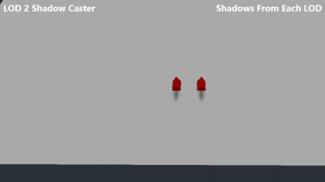

# Multi LOD

This is a collection of LOD systems for various built-in Godot types.

More detailed write-up available here:
[First write-up](https://puchik.now.sh/posts/lod/).
[Second, newest write-up](https://puchik.now.sh/posts/multithreaded-lod/).
[Video](https://www.youtube.com/watch?v=4xWTnD7X1jU)

For all the sytems, there is a tick speed that specifies how often the distances should be checked. Also, setting any distance to -1 will disable a detail level (e.g. don't use
LOD1, never fade out shadows, etc.)

# Installation

Drag and drop the MultiLOD folder from the `addons` folder into your `addons` folder. The source code is available in the `src` folder.

# Node types

**Any VisualInstance inheriting object**

You can attach the regular LOD script to switch its children. If you do not specify the LOD0, LOD1, LOD2 objects, the
system will look for children whose names contain LOD0/LOD1/LOD2, so it's partially automatic.

Use "disableProcessing" (off by default) to have the \_process and \_physics_process functions disabled when the LOD is disabled

**Light nodes**

You can specify a distance where shadows fade out and get disabled, a distance where the light itself fades out and gets disabled,
and a range where the fading happens (max distance - fade range is when it starts to fade out).

**GIProbes**

You need to be careful with GIProbe placement (as usual with GIProbes). The idea is to have a grid of overlapping GIProbes. Play around with the subdivison number, size of GIPRobe etc to get the effect you want without making the grid obvious. NOTE: for 4 GIProbes to be able to blend and affect a single object at the same time, you should get the [GIProbe blending patch](https://github.com/puchik/godot-extras/tree/master/patches/giprobe-blending) (also in this repository) and apply to your fork of Godot and recompile the engine. Otherwise, this "LOD" system is sort of useless.

The idea is to have your "main" world meshes separated (no huge spots of ground), and have overlapping GIProbes. Something like this (blue squares are your map chunks, green squares are GIProbes):

**MultiMeshInstance**

Define the max and min number of visible instance (max visible instances = -1 will set it to the number of instances itself), the min and max fade distance, and an exponent for the fade. The number of visible instances will fade from the min to max range according to a curve
defined by the exponent. By default, the exponent = 1, meaning the fade will be linear. (Maybe I'll eventually add the actual Godot curve type!).

# Exposed functions

These are the functions you can call on the LOD Manager. Do *not* call the internal threading functions manually.

**LODManager**

* `set_up_camera()`

Call this if the camera you want to use has changed. It will automatically fetch the current camera and do required setup, such
as setting the FOV and updating the LODs accordingly. Returns false and does nothing if an error occurs.

* `set_camera(Node given_node)`

Similar to `set_up_camera()`. This way you can define a custom camera by passing a Node yourself. Returns
false and does nothing if the given node is not a Camera or some other error occurs.

* `update_fov()`

If you have changed the FOV on your camera, you need to call this if you want the LOD to take those changes into account. 
Automatically called by `set_up_camera` and `set_camera` after a camera is set.

* `update_lod_multipliers_from_settings()`

Updates the LOD multipliers from the Project Settings. Call this after changing your Project Settings for the LOD.

* `update_lod_AABBs()`

If your objects have been resized and you are using screen percentages for LOD, you need to call this for the LOD distances
to be updated. You can also call this on individual objects.

* `stop_loop()`

If, for whatever reason, you need to stop the LOD functionality, you can call this function. Note that you *cannot* restart it
once it is stopped (at this time).

**LOD objects**

* `update_lod_AABBs()` or `update_lod_AABB()`

The plural version is for the general LOD. The singular version is for all other LODs (e.g., Lights, MultiMesh). This will
recalculate the AABB-based screen percentage LOD distances on this one specific object. Can be called globally on the LOD Manager.

* `update_lod_multipliers_from_manager()`

Lets you update the LOD multipliers from the manager. Called automatically by the LOD Manager when you use `update_lod_multipliers_from_settings()`. You can use this to reset the multipliers if you've set them manually without affecting
other objects.

* `max_shadow_caster: int => enum { LOD0, LOD1, LOD2, LOD3 }`

Don't use any higher resolution LODs than this one, to calculate shadows. Setting LOD2 or LOD3 are recommended.

This variable provides the ability to use **shadow impostors**. The renderer normally renders a mesh multiple times, once for the visual image in color, then possibly several more times for each light to generate a shadow. It is usually unnecessary to have highly accurate or detailed shadows, so you can reduce the rendered vertex count tremendously by using a lower level of detail for the shadow caster.

For example, say you have a tree model with these vertex counts: LOD0=40k, LOD1=20k, LOD2=10k, LOD3=1k. When rendered, LOD0 might register 100k vertices with shadows. However if you disabled shadow casting (in the GeometryInstance section of the inspector) for LOD0 and LOD1, and set LOD2 to shadows only and visible, you might render only 50k vertices with a shadow that looks virtually identical to the one calculated from LOD0.

The sample scene has two objects with different shapes for the LODs. You can see in the image below, the object on the right has a shadow rendered from each active LOD. The one on the left stops increasing the shadow resolution at LOD2, thus the shadow is from the cube even when displaying the sphere and cylinder. When the LODs are of similar shapes like a tree, the differences in shadows will be unnoticable.
 

# Notes
You need the GDNative library to point to the library file (e.g. .dll) correctly, and then the have the NativeScripts correctly point to the library. Have a read of the GDNative documentation in the docs if you're having trouble.
For Windows, this is already set up.

Alternatively, the source C++ files are also in this directory. You'll need them to compile for different platforms, make any changes you'd like, or see the internals.

# FAQ

* Nothing is happening!

Make sure the LODManager has the correct reference to the camera. It will try to find a camera if it doesn't have one, but
if the camera is changed or no longer exits you will have to manually call `setUpCamera` or `setCamera(your_camera_node)`.

* The node LOD is crashing when I start up my game.

There are multiple reasons this may happen and some will throw an error message. For one, you need to have at least a LOD0
node. Another thing you can do is check if you've changed any of the defaults to broken values. 

* I get crashes with or without any nodes. Only the manager is present.

Try running the scene with multithreading disabled on the LODManager (in the LodManager scene in your addons folder). This
way you may also get an error message (since Godot doesn't currently (27-03-2021) support multithreaded debugging...). Also
try using the different `debug_level` parameters on the LOD Manager.

* Anything else?

Make an issue with your problem, expected behaviour, and, if applicable, some images. A small reproduction project is appreciated. I'd be glad to take a look.

# Limitations

If you have many objects, your message queue will overflow. You will need to increase its size in project settings.

# Compiling

Only a Windows library is provided at this time.

A SConstruct is included. It targets the path `addons/MultiLOD/bin/`. The repo does not link to the godot-cpp submodule yet.
See the [official GDNative tutorial](https://docs.godotengine.org/en/stable/tutorials/plugins/gdnative/gdnative-cpp-example.html) for compiling instructions for every platform.

# Known bugs:

You tell me :)
